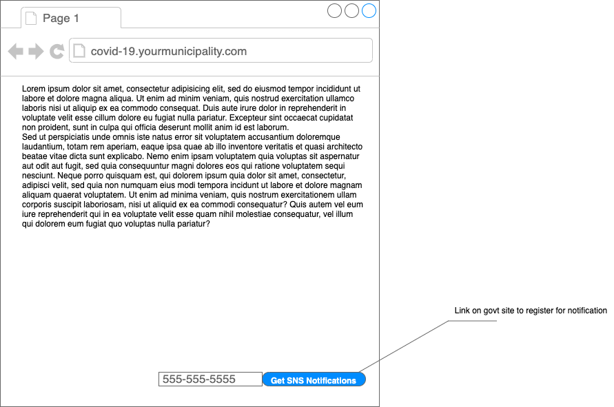
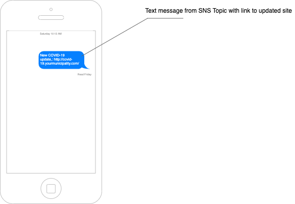

# AWS Samples - Government update via SMS (SMS)

### Note: 
This README is meant to supplement the CovidUpdateSnsDeploymentGuide provided along with this file. See that file for deployment instructions.

### Solution Description
This solution aims to send you a SMS when a government entity updates the latest information concerning the Covid-19 crisis.

**Important:** this solution only works in the following regions:
- US East
    - us-east-1	(N. Virginia)
    - us-west-2 (Oregon)
- GovCloud
    - us-gov-west-1 (US-West)
- Europe
    - eu-central-1 (Frankfurt)
    - eu-west-1 (Ireland)
- Asia Pacific
    - ap-northeast-1 (Tokyo)
    - ap-south-1 (Mumbai)
    - ap-southeast-1 (Singapore)
    - ap-southeast-2 (Sydney)

Here you can find the list of countries and regions where you can send SMS messages through SNS: https://docs.aws.amazon.com/sns/latest/dg/sns-supported-regions-countries.html

## AWS Services behinds

List of the services used:
- S3
- Lambda
- IAM
- CloudWatch Events
- SNS
- Pinpoint

# Workflow

- The user registers his phone number through the website of the government which sends updates concerning Covid-19:

- Then, the user receives an SMS message for each update from the website:

- Here is the entire workflow of what's happening behind the scene:

## Security

See [CONTRIBUTING](CONTRIBUTING.md#security-issue-notifications) for more information.

## License

This library is licensed under the MIT-0 License. See the LICENSE file.

